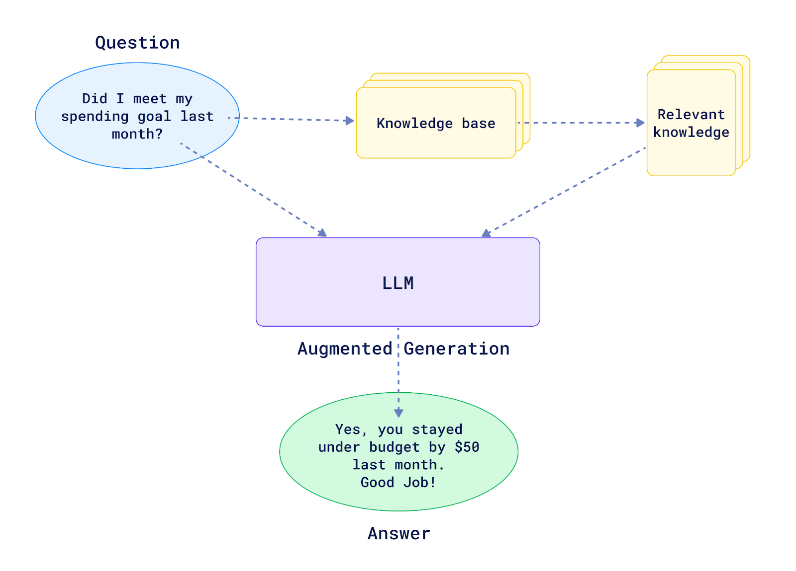

# Game Recommendation System

A chatbot that helps you find games according to your mood.

## Tech Stack Used
- **MistralAI** (via HuggingFace 🤗)
- **QdrantDB**
- **LangChain**
- **Streamlit**
- **Beautiful Soup**

## Deployment
- **Website on Render free tier:** [Game Recommendation System](https://playstore-llm.onrender.com)
- **Qdrant Vector store on AWS EC2 instance**
- Can scale both independently according to need

## Approach

1. **Data Collection:**
   - Used Beautiful Soup to scrape the top 100 games available on [Playstore](https://play.google.com/store/apps/collection/promotion_300201f_top_selling_free_games?hl=en_IN&gl=US).
   - A cron job is set up to update the JSON store weekly.
   - Used [this](./scrapper.py) python script for scrapping the data

2. **JSON Document Structure:**
    ```json
    {
        "name": "Clash of Clans",
        "package_name": "com.supercell.clashofclans",
        "tag_list": [
            "Strategy",
            "Build & battle",
            "Casual",
            "Single player",
            "Multiplayer",
            "Stylized",
            "Cartoon"
        ],
        "description": "Strategic game with ...",
        "icon_url": "https://play-lh.googleusercontent.com/LByrur1mTmPeNr0ljI-uAUcct1rzmTve5Esau1SwoAzjBXQUby6uHIfHbF9TAT51mgHm=s256-rw",
        "game_url": "https://play.google.com/store/apps/details?id=com.supercell.clashofclans"
    }
    ```

3. **Retrieval Augmented Generation (RAG):**
    

## Steps to Run
1. **Ensure Docker and Docker Compose are installed:** [Docker Installation Guide](https://docs.docker.com/get-docker/)

2. **Set up environment variables:**
   - Copy `.example.env` to `.env`
   - Paste the access token from [HuggingFace](https://huggingface.co/settings/tokens)

3. **Build and run the application:**
    ```bash
    docker-compose up -d --build
    ```

4. **Access the chatbot:**
   - Open your web browser and go to `localhost:8501` to interact with the game recommendation system.

---
